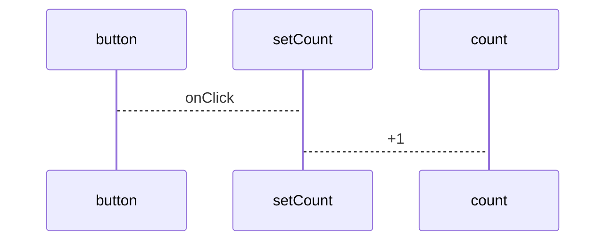
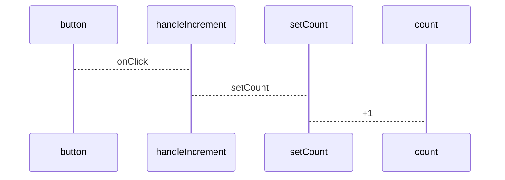

[](https://generalassemb.ly)

# Intro to State


## Learning Objectives

After this lesson you will be able to:

- Explain what `state` is and how to implement it in React
- Use `Array Destructuring` to create variables from an array
- Update `state` and re-render the Component

## Framing

The best analogy to understand React `state` is to start by answering the following question: **How are you feeling this very moment?**

- Are you happy to be in class learning a new topic?
- Are you frustrated having to sit in class for the next two :two: hrs after a long day?
- Did some random person say `hello` out of the blue make you smile?

The answer to any one of those questions has a direct impact on the `state` of mind your in. A `happy` state will be reflected in your smile, tone of voice, being nice to others in return. An `unhappy` state will have the opposite effect.

As with all human beings our `state` of mind can change on the fly which is almost always reflected in our facial expressions or actions. Applications also have a `state` which is reflected in the UI.

Therefore updating an applications `state` is our control mechanism for how we update the DOM.

## Props Recap

So far we've worked with `props` and used them to pass values from a `parent` to a `child` Component. This pattern of passing data down will be consistent in React as the flow of data is `unidirectional` and always flows down.

We also know that the props passed down to a child are organized, by React, into an object where every prop becomes a `key:value` pair.

Props are a great way to pass data but have the following limitations:

- Props are immutable
- React will ignore any attempt to reassign a prop value
- Reassigning a prop value will have no effect on the Component.

---

### :alarm_clock: Activity - 2min

Let's take a moment to view our previous code to open the `Card` Component and add the following:

<!-- <https://codesandbox.io/s/rctrr-8-8-20-bootstrap-solution-uyvmg?file=/src/App.js>

**Note:** Feel free to fork this CodeSandbox if you missed last class or want a fresh codebase to start with. -->

```jsx title="Card.jsx"
console.log("current props.title", props.title);
// ATTEMPT TO REASSIGN PROPS A NEW VALUE
props.title = "Mykonos";
console.log("props.title", props.title);
```

Refresh the page and you should see the following:

> current props title - Santorini
>
> new props.title - Santorini

So it looks like props was not changed and so we have confirmed that once a Component has been passed props that any attempt to change those props directly will have no effect.

---

#### :mag: Check for Understanding - 2min

The instructor will set a timer for two :two: min.

- Take two :two: minutes to think about and write your answers to the following questions:
  - What do we use `props` for?
  - How does the receiving Component organize `props`?
  - What limitations do `props` have?
  - Is there any best practice you can think of when creating a `prop`?
- When asked slack your answer(s) in a thread created by the instructor

---

## Intro To State

In our attempt to provide a coherent framing of React `state` the point was made that what you see on the page is the current version of the `state` of the application. Any changes to `state` , aka `data`, will then be reflected in the UI.

One important thing to note here is that any changes to state will cause the Component to `re-render`.This is essentially how the UI is updated.

This is a very important concept to keep in mind as a `re-render` can also initiate additional function calls, something we will discuss as part of Reacts `lifecycle methods`.

### Working With State

So updating state will, most often, require the user to interact with the application. Hence, the user performs some action, like clicking a button, and the component responds by `doing a thing` and updating `state`.

We've done a fair amount of framing and explanations so far, so let's dive in to building our application!

### A Simple Counter Component

We'll walk through building a very simple `Counter` Component which will provide the user 2 buttons to increment or decrement a value displayed on the screen.

#### Spin Up A New React Application

For this demo you will spin up a React application using CRA or Vite

#### Creating The Counter Component

---

#### :alarm_clock: Activity - 3min

Since you already have experience creating Components take a minute to perform the following activity.

- Create a new file in `src` called `Counter.jsx`
- Import `React`
- Create the Component
- Return the following html:

```jsx title="Counter.jsx"
<>
  <span>Current Count: 0</span>
  <section>
    <button>+</button>
    <button>-</button>
  </section>
</>
```

- Export the Component
- Import the Component into `App.js`
- Replace all the _HTML_ inside of `className="App"` with the `Counter` Component.

```jsx title="App.js"
<div className="App">
  <Counter />
</div>
```

Once your done React should render the following:


That HTML looks like it could use a little styling. So lets copy/paste the following css to `styles.css`

<details>
<summary>CSS</summary>

```css
.App {
  font-family: sans-serif;
  text-align: center;
  width: 160px;
  margin: auto;
  display: flex;
  flex-direction: column;
}

section {
  display: flex;
}

button {
  flex: 1;
}

span {
  font-size: 20px;
}
```

</details>

And now the design should update to look like:


---

### Working With useState

In order to add state to the `Counter` Component we will first need to import the `useState` Hook from `React`. `useState` is one of the three :three: Basic Hooks as per the Official React Doc.

#### A Word On Hooks

Hooks were introduced in React Version `16.8`. Before hooks, all state needed to be within a `Class` component.

Hooks introduce state management to Functional components, using a simpler and more flexible API and let you split one component into smaller functions based on what pieces are related"

#### Class Component State Example

Class components come with a lot of boilerplate, which can feel bulky, especially when dealing with a simpler state.

Here is how state would have been configured using a class Component.

```jsx title="Counter.jsx" live
class Counter extends React.Component {
  constructor(props) {
    super(props);
    this.state = { count: 0 };
  }
  render() {
    return <p>My Count is {this.state.count}</p>;
  }
}
```

Although with the the next ES class properties proposal and the help of`Babel` to transpile the code the above could be written as:

```jsx title="Counter.jsx" live
class Counter extends React.Component {
  state = { count: 0 };

  render() {
    return <p>My Count is {this.state.count}</p>;
  }
}
```

#### State of Transition

We are currently in a state of transition in world of React. Hooks were a game changer and I"m sure there is more to come down the line.

There is certainly more code out there written in the previous syntax but Hooks are now what developes turn to first when building new applications or Components within an existing codebase.

---

#### :alarm_clock: Activity II - 2min

Since we will be working with `Hooks` solely in this class let's take a minute to review the following React Docs:

- [Hooks API Reference](https://reactjs.org/docs/hooks-reference.html) - all the available Hooks
- [useState Hook](https://reactjs.org/docs/hooks-state.html) - useState specifically

---

#### Importing useState

Now it's time to import `useState` into the Counter Component.

The react library has a key called `useState` that we elicit from `react` and store in a variable of the same name. We will do so by using `Object Destructuring`.

The `react` object has a key called `useState` and by using `{useState}` we can store the value returned in the key into a variable of the same name.

```jsx title="Counter.jsx"
import React, { useState } from "react";
```

Essentially we are doing something similar to the following but this would need to be on a separate line as `React` would first need to be imported.

```jsx title="Counter.jsx"
import useState from React.useState
```

Just so that we get a better idea of what `useState` actually is let's add a console log.

```jsx title="Counter.jsx"
const Counter = () => {
  console.log("useState - ", useState);
  // ...rest of code
};
```

The output should look like the following:


It appears that `useState` is a function that takes in in `initialState`, calls a supporting function and returns `dispatcher.useState()`.

We won't get into the underlying code here but one thing to to highlight is the keyword `dispatcher`.

We will revisit this concept later when we cover the `useReducer` hook as it uses a similar convention of naming it's corresponding function `dispatch`.

---

#### useState Rules and Best Practices

Let's take a moment to cover some of the `rules` and `best practices` of using `useState`.

:oncoming_police_car: - Rules

Here are some of the rules that govern the useState Hook:

- never update the state value directly
- always use the `setState` function to update state
- since state is never directly edited and must always be overwritten with a new value

:star: - Best Practices

A few best practices when assigning variable names are:

- Use `Array Destructuring` when initializing the state variables
- Name the initial state based on what it contains
- Use the same name for the function but precede it with `set`
- Use a the callback function version of useState if you need to reference the previous version of state
- Give thought as to what needs to be in state and how that state should be organized and structured
- Always use `...spread` operator to copy object and array values to the new state

---

#### Creating An Instance Of State

With `useState` imported it's time to create an instance of state. To do this we will call `useState()` and pass it an initial starting value of `0`.

:star: Name the initial state based on what it contains.

```jsx title="Counter.jsx"
const countState = useState(0);
```

Once again let's add a `console.log` and see what it returns.

```jsx title="Counter.jsx"
const countState = useState(0);
console.log("countState -", countState);
```

We should see the following:


So it appears `countState` is set to an array that contains the following elements:

- `0` - the initial state value we defined
- a `function` - which will be used to update state.

One way to create two :two: new variables based on the array would be to manually elicit their values using bracket notation.

In keeping with best practices we will name the initial state variable `count` as it will use it to increment/decrement a starting value essentially keeping `count`. Of course, the corresponding function that will be used to update state should be called `setCount`.

:star: Use the same name for the function but precede it with `set`

```jsx title="Counter.jsx"
const count = countState[0];
const setCount = countState[1];
```

#### Array Destructuring

:star:
A more convenient way of doing this is using ES6 [Array Destructuring](https://javascript.info/destructuring-assignment).

This elicits the values from the array based on their position and stores them in variables.

```jsx title="Counter.jsx"
const [count, setCount] = useState(0);
```

#### Using State

Now that our initial value is been assigned to the `count` variable let's update the _JSX_ to use that value instead of a current hard coded value of `0`.

Of course, as has been stated several times already, _JSX_ requires that all JavaScript be surrounded in curly braces.

```jsx title="Counter.jsx"
return (
  <div>
    <span>Current Count: {count}</span>
    ... rest of code
  </div>
);
```

#### Updating State

With our state value in place it's time to provide some functionality to the buttons and allow the user a means to interact with the app and update state.

In the case of our Counter the only way to update `count` is to call the `setCount` function and pass it a new value.

:oncoming_police_car: Always use the `setState` function to update state

There are 2 ways to perform this action:

```jsx title="Counter.jsx"
// grab the current version of state
setCount(count + 1);

// OR

// use a callback function and pass the previous version of state
setCount((prevState) => prevState + 1);
```

In the second example the setter function takes in an callback function that is passed the previous value of state and returns a new value altogether.

The argument in this example is called `prevState` by convention but you can name it anything you want.

There are scenarios when the callback function version is required such as when state is being updated within the callbacks of either a `setTimeout()` or `setInterval()`.

#### Adding an onClick Event

In order to allow the user to interact with the buttons we will need to add an event listener.

React event listeners are an additional topic we will revisit again in future lessons. They are essentially `synthetic events` based on the real underlying JS events and perform the same operations as before. Events you might have worked with before are:

- click => `onClick()`
- submit => `onSubmit()`
- change => `onChange()`
- mouseover => `onMouseOver()`

For now we will add an `onClick` event listener that calls `setCount` to update state.

Also, as with plain JavaScript or jQuery we will use an anonymous callback to pause the execution until the click event has occurred.

```jsx title="Counter.jsx"
return (
  <div>
    <span>Current Count: {count}</span>
    <section>
      <button onClick={() => setCount(count + 1)}>+</button>
      <button onClick={() => setCount(count - 1)}>-</button>
    </section>
  </div>
);
```

If we test out the app we should see that the count value will change based on user input.



#### Event Handlers

Working with React certainly requires that we write code in very specific and opinionated ways. That is a good thing in that we can quickly examine code and expect some consistency in how it is written.

But some React code is written solely based on the adoption of the community at large. One such pattern is creating `event handler` functions and preceding their name with `handle`.



Let's give that a try by creating the following supporting functions:

- `handleIncrement`
- `handleDecrement`

```jsx title="Counter.jsx"
const handleIncrement = () => {};

const handleDecrement = () => {};
```

Now let's move the `setState` function calls into their corresponding `handler` functions and update the `onClick` to reflect this refactor.

```jsx title="Counter.jsx"
const handleIncrement = () => {
  setCount(count + 1);
};

const handleDecrement = () => {
  setCount(count - 1);
};

<section>
  <button onClick={handleIncrement}>+</button>
  <button onClick={handleDecrement}>-</button>
</section>;
```

The other added benefits of using these supporting `handler` functions are:

- its a much better way to organize our code
- we now have a function that can be passed down to a child Component as `props`

This concept of passing a function down to a child Component where the function is being executed in the parent scope. This is how we pass values from a child to a parent and a concept knows as `lifting state`.

---

#### :alarm_clock: Activity III - 2min

With our event handlers in place and updating state let's take a look at the `React DevTools Components` tab. If you highlight `Counter` it should look like the following:


Try incrementing the value a few times and you should see it update.


---

#### State Update Delay

Although the updates to state appear immediate there is one thing to note. After calling `setCount` the new value assigned to state isn't available until the Component `re-renders`.

So if we were to console log `count` immediately after it's been updated we would see it outputs the previous version of state.

```jsx title="Counter.jsx"
const hanndleIncrement = () => {
  setCount(count + 1);
  console.log("handleIncrement - count:", count);
};
```

Here we can clearly see that `count` is now `2` but the console logs show that count is one :one: value behind.


There will be instances where some logic needs to be run based on the change in state but we can only do this after re-render and only using the`useEffect()` hook.

The `useEffect` hook is a much broader topic and delves into the `React Component Lifecycle` methods, something we will learn about in upcoming lectures.

---

#### :alarm_clock: Activity IV - 3min

Let's try a quick activity that should help you apply some of these concepts.

- Add a new `Reset` button to the Component that, when clicked, will reset the counter back to 0.
- Use the `handler` model that we used to setup the previous buttons.
- Call setCount to update state

#### Bonus

- Try using the callback function with SetCount.

---

#### Final Solution

Here is the final version of the Counter Component.

<details>
<summary>Solution</summary>

```jsx title="Counter.jsx" live
// import React, { useState } from "react";

function Counter() {
  const [count, setCount] = useState(0);

  const handleIncrement = () => {
    setCount(count + 1);
  };

  const handleDecrement = () => {
    setCount(count - 1);
  };

  const handleReset = () => {
    setCount(0);
    // BONUS
    // setCount( prevState => 0)
  };

  return (
    <div>
      <span>Current Count: {count}</span>
      <section>
        <button onClick={handleIncrement}>+</button>
        <button onClick={handleDecrement}>-</button>
        <button onClick={handleReset}>Reset</button>
      </section>
    </div>
  );
}

// export default Counter;
```

</details>

---

#### :mag: Check for Understanding II - 2min

The instructor will set a timer for 2min.

- Think about the following questions:
  - What do we use `props` for?
  - What do we use `state` for?
  - What is the difference between `state` and `props`?
- Take a moment to write out your best answer for each question, 3 answers in total.
- When asked slack your answer(s) in a thread created by the instructor

**Note:** Do not slack your answers until the instructor has given the ok.

---

### Bonus - Using Conditional Logic and Ternary Operators

Since React is all JavaScript we can use all of our previous JS expertise when trying to implement additional, non React specific, logic.

Let's add some basic conditional logic to the `handleIncrement/handleDecrement` that will reset the count to `0` if it meets a specific threshold.

#### IF/ELSE

```jsx title="Counter.jsx"
const handleIncrement = () => {
  if (count === 3) {
    handleReset();
  } else {
    setCount(count + 1);
  }
};
```

#### Switch Statements

Another form of conditional logic is to use a switch statement. They are the conditional logic of choice for `reducers` and will be seen again when we we get to the `useReducer` hook.

For now let's refactor the code to use a switch statement.

```jsx title="Counter.jsx"
const handleIncrement = () => {
  switch (true) {
    case count === 3:
      handleReset();
      break;
    default:
      setCount(count + 1);
  }
};
```

#### Ternary Operators

Most often React developers prefer to write a single if/else conditional as a `ternary` operator. So let's perform our last refactor.

#### handleIncrement

```jsx title="Counter.jsx"
const handleIncrement = () => {
  count === 3 ? handleReset() : setCount(count + 1);
};
```

### Resources

- [React Docs - useState](https://reactjs.org/docs/hooks-overview.html)
- [The useState Hook - robinwieruch](https://www.robinwieruch.de/react-usestate-hook)
- [React useState Hook Guide - dmitirpavlutin](https://dmitripavlutin.com/react-usestate-hook-guide/)
- [React Event Handlers - robinwieruch](https://www.robinwieruch.de/react-event-handler)
- [ES6 Tutorial](https://www.javascripttutorial.net/es6/)

---

_Copyright 2022, General Assembly Space. Licensed under [CC-BY-NC-SA, 4.0](https://creativecommons.org/licenses/by-nc-sa/4.0/)_
