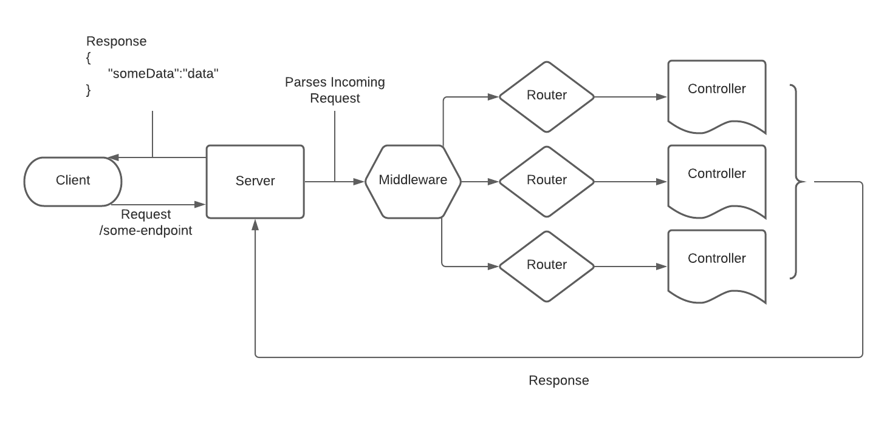

[](https://generalassemb.ly)

# Express Controllers

## Overview

In this lesson, we'll be learning about Express controllers. Controllers are functions that we build to handle specific requests. Instead of handling logic inline with our routes/endpoints, we build methods to handle that logic. The aim is to organize and reuse as much code as possible.

## What Are Controllers

Controllers are methods that we create to handle how our server behaves during a request. They are in charge of sending back the requested information for a specific endpoint. We typically group them based on the actions that they perform and for the `router` that handles an endpoint or `route`. For example, if we have a `router` that handles all requests for a user ie. `log in`, `register`, `profile` etc.. We would create a controller to handle all of these endpoints. Our controller is a group of functions that will then handle the behavior for a specific `endpoint`.

If our user requests to `log in`, we would have a controller method that handles only the log in functionality for our server.

The following diagram shows the flow during the `request`/`response` lifecycle:



We want to keep our codebase as organized as possible. This helps us to later scale by adding features or functionality. By taking a simple functional approach, if we wanted to add a new feature, we could just add a new function or controller to handle that request.

## Creating Controllers

Create a folder called controllers in the root directory of your repo:

```sh
mkdir controllers
```

Inside the controllers folder create a file called `CatController.js`.

```sh:
touch controllers/CatController.js
```

Inside of `CatController.js` we'll be creating functions that handle different HTTP requests.

Create a function called `getCats`, this function will accept a `request` and `response` as arguments/parameters.

Send a `response` with the following:

```js
const getCats = (request, response) => {
  res.send({
    message: 'Getting Cats'
  })
}
```

We now need to be able to use this function for a specific route by exporting it. At the bottom of your `CatController.js` add a `module.exports`:

```js
module.exports = {
  getCats
}
```

## Using Controllers

Now that we've created a controller, it's time to put it to use. Back in your `app.js`, create a `GET` route with an endpoint of `/cats`.

```js
app.get('/cats')
```

Let's use our `getCats` function in our `CatController.js` file.

At the top of your `app.js`, we need to `require` our controller file.
Add the following below all of our other `require`.

```js
const catController = require('./controllers/CatController.js')
```

Now in our `GET` cats endpoint use the `getCats` function, our `catController` functions were exported as an object, so we would apply this function by doing the following to your `app.get('/cats')`:

```js
app.get('/cats', catController.getCats)
```

Now let's test this endpoint. In your rest client, perform a `GET` request on: `http://localhost:3001/cats`

You should recieve a 200 status code and a JSON object:

```json
{
  "message": "Getting Cats"
}
```

## Recap

In this lesson, we learned how to break up the functionality of our server into modular but effective pieces of code. By utilizing this pattern, adding features and functionality are much simpler and unintrusive. Express was meant to be lightweight and scalable, and by leveraging modular code, we can adhere to best practices and patterns.

## Resources

- [Express](https://expressjs.com/)

---

_Copyright 2022, General Assembly Space. Licensed under [CC-BY-NC-SA, 4.0](https://creativecommons.org/licenses/by-nc-sa/4.0/)_
