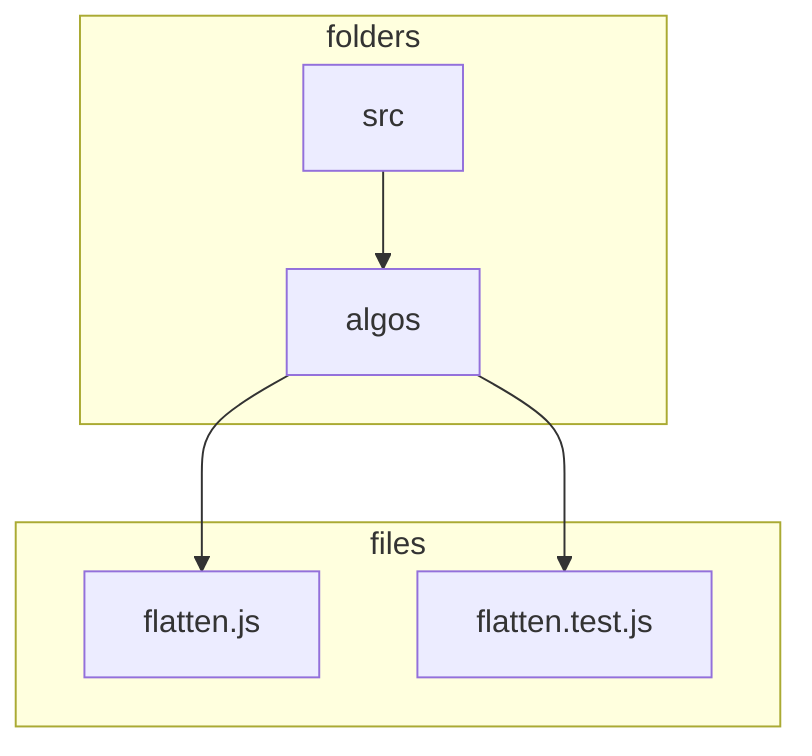

[](https://generalassemb.ly)

# Testing in React with Jest

## Learning Objectives

- Discuss the features of Jest and Enzyme
- Finish setting up a development environment with create-react-app
- Implement test driven development processes
- Use Jest and Enzyme to test React applications

## Framing

We all run `tests` with each line of code we write. That test is `did the thing work as expected` or did it break something. Although we can't truly escape writing our code in this fashion there is a flaw in that approach and one we have all experienced at some point. Fixing one problem breaks something else all together.

This is where formal testing comes in. It ensures that your app is continuing to function as expected, and can save you a massive headache down the road, a few of which are:

- Ensuring that the code continues to yield the desired result, and does not break with further development.
- Testing for various use cases, rather than just the one that you performed.
- Reminding you why code is written a certain way (to handle the finicky third-party package rendering, or ensure that functions come to completion in the proper order, etc.)

## Testing Libraries

We will be using the following libraries to create and run our tests.

- [Jest](https://jestjs.io/en/)
- [React Testing Library](https://github.com/testing-library/jest-dom)
- [Enzyme](https://github.com/airbnb/enzyme)

**Jest** and **React Testing Library** are used very much in conjunction with one another, and it is nearly impossible to talk about one without the other. You can think of **Jest** as doing the actual testing, while **React Testing Library** recreates the thing to be tested

**Enzyme** is used to mimic JQuery's DOM manipulation library to make testing React even easier. It allows us to grab the state of the component, simulate user actions, and grab elements from the virtual DOM.

## Starting With Jest

[Jest](https://jestjs.io/en/) is an easy to configure testing framework built by Facebook for testing JavaScript code. It's one of the most popular ways to test React components nowadays.

### Running A Single Test

Test are created using either `it()` or `test()`. Both functions perform the same action and in the end it comes down to readability and more so about the actual test message.

```js
test("does this thing", () => {});

// VS

it("should do this thing", () => {});
```

### Creating A Suite Of Tests

Several tests can be combined into a `suite` of tests by wrapping them in `describe()`.

Here is an example of several tests being run against an algo that flattens an array.

```js
// TEST SUITE
describe("Flatten Array Tests", () => {
  // TEST CASE
  it("should flatten an array.", () => {
    // test goes here
  });

  it("should return an empty array if the input is an empty array.", () => {
    // test goes here
  });
});
```

---

#### :alarm_clock: Activity - 3min

Let's take a look at the docs on running tests in [CodeSandbox](https://codesandbox.io/docs/tests)

--

## Starter Code

The starter code we will be using is a full `create-react-app` build and is slightly different then the React app we are able to spin up using the React CodeSandbox template.

Here is the starter code: [CodeSandbox React Testing](https://codesandbox.io/s/rctr-react-testing-7w0uk)

## Flatten An Array Test

Let's write our first test. Inside the `src` folder there is a folder called `Algos` which contains two files: `flatten.js` and `flatten.test.js`



<!--  -->

If we take a look at `flatten.js` we will see it contains the code needed to flatten an array of nested arrays.

```js
const flatten = (arr, result = []) => {
  arr.forEach((elm) => {
    switch (true) {
      case Array.isArray(elm):
        flatten(elm, result);
        break;
      default:
        result.push(elm);
    }
  });
  return result;
};

export default flatten;
```

This code would indeed return a flattened array. We can even test this out in this [repl](https://repl.it/@jkeohan/algo-flatten-array-2-solutions).

```js
flatten([1, [2, 3], [[4], 5]]); // => [(1, 2, 3, 4, 5)]
```

### Our First Test

If we take a look at `flatten.test.js` we see that contains no code.

Since there are no tests written our testing results should be empty.


Of course the idea here is that the user would need to figure the code to the algo themselves and then run the tests to validate they got it right.

Our goal however is to create a series of tests that would validate the results of running that code.

Let's start by creating a single test that includes the input and out results

```js
it("should flatten an array of arrays.", () => {
  const nestedArray = [1, [2, 3], [[4], 5]];
  const flatArray = [1, 2, 3, 4, 5];
});
```

Now we use the `expect()` function that then runs the algo passing in the array to be flattened and then compares the results.

```js
it("should flatten an array of arrays.", () => {
  const nestedArray = [1, [2, 3], [[4], 5]];
  const flatArray = [1, 2, 3, 4, 5];
  expect(flatten(nestedArray)).toEqual(flatArray);
});
```

Since we know the algo does what it's supposed to do we should see that our test has passed.


Let's force our test to fail so we can see the results of a failed test.


---

#### :alarm_clock: Create Test Activity - 3min

Now it's your turn to create the following tests:

- it should return an empty array when the input is an empty array
- it should return a flattened array if the input contains 4 levels of nested arrays

---

ADD SOLUTION CODE HERE

<details><summary>Solution</summary>

```js
it("Returns empty array when the input is an empty array.", () => {
  const array = [];
  const result = flatten(array);
  const expectedResult = [];
  expect(result).toEqual(expectedResult);
});

it("Goes 4 levels deep.", () => {
  const nestedArray = [[1, 2, [3, [[4], 5]]], [6]];
  const flatArray = [1, 2, 3, 4, 5, 6];
  const result = flatten(nestedArray);
  expect(result).toEqual(flatArray);
});
```

</details>

### Test Suites

Being that these tests are meant to test the validity of the same code we could have placed them in a `describe()` so they are viewed as a suite of tests.

```js
describe("Flatten tests:", () => {
  it("should flatten an array of arrays.", () => {
    // ...code
  });

  it("should returns empty array when the input is an empty array.", () => {
    // ...code
  });

  it("should flatten an array that is at least 4 levels deep.", () => {
    // ...code
  });
});
```

## Testing Using The React Testing Library

Testing in React uses the same approach for creating individual tests and organizing them into a suite of tests.

We do however need to leverage the `React Testing Library` and, for even more advanced testing we would need the assist of `Enzyme`.

### Setup

Let's first create a filed called `App.test.js` and import both `React` and the `App` component.

```jsx title="App.test.js"
import React from "react";
import App from "./App";
```

We will need to import both `render` and `screen` from the testing library.

```jsx title="App.test.js"
import React from "react";
import App from "./App";
import { render, screen } from "@testing-library/react";
```

---

#### :alarm_clock: Documentation Activity - 3min

Let's take a minute to look at the documentation for [screen](https://github.com/testing-library/jest-dom#using-dom-testing-library-1) as it will hold the DOM elements and run the query.

---

### Writing Our Test

Our basic test will confirm that the text **"learn react"** is being rendered via the `App` component.

For that we will need to `render` the component and then query the page for the text using `screen.getByText()`

```jsx title="App.test.js"
import React from "react";
import { render, screen } from "@testing-library/react";
import App from "./App";

test("renders learn react link", () => {
  // RENDERS THE APP COMPONENT
  render(<App />);
  // EXAMINES THE TEXT ON THE PAGE LOOKING FOR 'learn react'
  const linkElement = screen.getByRole("link", /learn react/i);

  // LETS SEE WHAT THIS RETURNS
  screen.debug("linkElement", linkElement);
});
```

Here is what `linkElement` returns:


In order to confirm that the test meets our expectations we use the `expect()` function as before.

```jsx title="App.test.js"
import React from "react";
import { render, screen } from "@testing-library/react";
import App from "./App";

test("renders learn react link", () => {
  render(<App />);
  const linkElement = screen.getByRole("link", /learn react/i);
  // THE EXPECT METHOD TO CONFIRMS THAT THE TEXT IS IN THE DOCUMENT
  expect(linkElement).toBeInTheDocument();
});
```

[expect().toBeInTheDocument](https://github.com/testing-library/jest-dom#tobeinthedocument)

## What is Enzyme?

[Enzyme](https://github.com/airbnb/enzyme) mimics JQuery's DOM manipulation library to make testing React easier. Using Enzyme we can also directly test `state` within a class based component (it doesn't yet support hooks) which the `React Testing Library` cannot do.

### Setting Up Our Environment For Enzyme

Now the `React Testing Library` comes completely configured within `create-react-app`, so we don't have to do anything else to get it working however `Enzyme` requires a bit of setup.

First we need to import the following packages:

- enzyme
- enzyme-adapter-react-16
- react-test-renderer

Then we need to create a file `setupTests.js`. Create-react-app reads this file to see if there is any additional setup for the tests. In that file let's import the `jest-dom` library and then configure Enzyme to use an `Adapter`

At the moment, Enzyme has adapters that provide compatibility with React 16.x, React 15.x, React 0.14.x and React 0.13.x. Since we are using the most current version of React lets configure the adapter to use v16.

```jsx title="setupTests.js"
import "@testing-library/jest-dom";
import { configure } from "enzyme";
import Adapter from "enzyme-adapter-react-16";

configure({ adapter: new Adapter() });

export default Adapter;
```

We just need to keep in mind that we will need to import this file into any of our `*.test.js` files that require Enzyme.

## Writing Tests Using Enzyme

Inside the `components` folder we will find both `Counter` and `HelloWorld`. We will be using these folder to organize our code for testing.

We will start with `HelloWorld` and need 2 files, one for our Component and the other to run our tests.

- `src/components/HelloWorld/HelloWorld.js`
- `src/components/HelloWorld/HelloWorld.test.js`

As before React will detect that there is a test but since there isn't anything in it nothing will happen.


### Testing Props

Let's write a test that confirm the `HelloWorld` component renders out a name that's passed to it via props.

Enzyme tests begin with rendering a React component, and for this, you have three choices:

- Shallow Rendering
- Full DOM Rendering
- Static Rendering

Let's start with Shallow Rendering as it should be used for tests that are limited in scope to the component being tested and will not need to test lifecycle method nor render any of it's children.

#### Initial Setup

Let's start by importing `React, shallow` and the `HelloWorld` component.

```jsx title="HelloWorld.test.js"
import React from "react";
import Adapter from "../../setUpTests";
import { shallow } from "enzyme";
import HelloWorld from "./HelloWorld";
```

Now we write the tests we would like to perform and place them in a test suite.

```jsx title="HelloWorld.test.js"
//...previous imports

describe("Hello world component", () => {
  it("should render props as expected", () => {});
});
```

Here we will be testing to confirm that the HelloWorld component was passed a prop value of `Your name`.

```jsx title="HelloWorld.test.js"
//...previous imports

describe("Hello world component", () => {
  it("should render props as expected", () => {
    const component = shallow(<HelloWorld name={"Your name"} />);
    expect(component.contains("Your name")).toBe(true);
  });
});
```

The testing engine should rerun automatically and this time the App and flatten tests passes but not HelloWorld.


Of course the reason being that we haven't written the actual HelloWorld Component as of yet.

Let's write the minimum amount of code needed for it to pass. In this example, we just need a component that renders `prop.name`.

```jsx title="HelloWorld.js"
import React from "react";

const HelloWorld = (props) => <h1>{props.name}</h1>;

export default HelloWorld;
```

The test passes without the need to import and run the component in App.


## Writing Tests for a Counter App

For this exercise, you will be using test driven development to write the React code to pass some pre-written tests.

We want to build a counter app. When we press a button, we want a number stored in state to increase, and when we press a second button that number will decrease. Given these test requirements, write a React component that passes the following tests.

### Initial Setup for Counter

Let's create a folder and some files for our counter app.

- `src/components/Counter/Counter.jsx`
- `src/components/Counter/Counter.test.jsx`

Copy the following code into the `Counter.jsx` component and we will write our tests to validate this code.

```jsx title="Counter.jsx" live
function Counter() {
  const [count, setCount] = useState(0);

  return (
    <div>
      <h1>Counter</h1>
      <div>
        Current Count:
        <span className="counter">{count}</span>
      </div>
      <section>
        <button className="plus" onClick={() => setCount(count + 1)}>
          +
        </button>
        <button className="minus" onClick={() => setCount(count - 1)}>
          -
        </button>
      </section>
    </div>
  );
}
```

Copy the following code into `Counter.test.jsx` to get us started.

```jsx title="Counter.test.jsx"
import React from "react";
import { render, screen } from "@testing-library/react";
import userEvent from "@testing-library/user-event";
import { beforeEach, describe, expect, it } from "@jest/globals";
import "@testing-library/jest-dom/extend-expect";

import Counter from "./Counter";

describe("Counter component", () => {});
```

<!-- <hr>

#### <g-emoji class="g-emoji" alias="alarm_clock" fallback-src="https://github.githubassets.com/images/icons/emoji/unicode/23f0.png">⏰</g-emoji> Activity - 20min -->

Here are the functions that are being used in case we want to review the [Jest](https://facebook.github.io/jest/docs/en/api.html) and [Enzyme](https://github.com/airbnb/enzyme/tree/master/docs/api) documentation and get a better idea of what they are doing.

#### Jest

- [.toBe()](https://jestjs.io/docs/en/expect#tobevalue)
- [.toEqual()](https://jestjs.io/docs/en/expect#toequalvalue)

#### Enzyme

- [.contains()](https://github.com/enzymejs/enzyme/blob/master/docs/api/ShallowWrapper/contains.md)
- [.find()](https://github.com/enzymejs/enzyme/blob/master/docs/api/ShallowWrapper/find.md)
- [.text()](https://github.com/enzymejs/enzyme/blob/master/docs/api/ShallowWrapper/text.md)
- [.simulate()](https://github.com/enzymejs/enzyme/blob/master/docs/api/ShallowWrapper/simulate.md)

### The Tests

Here are the tests we will create to test the Counter component and it's functionality.

- should have a header that says "Counter"
- should display the current number
- should have a button with a class name of `plus` that increases the number
- should have a button with a class name of `minus` that decreases the number

#### The Header Test

If we examine the Counter component we can see that it contains an h1 with the text Counter and that is what we will run our test against.

```jsx title="Counter.test.jsx"
describe("Counter component", () => {
  it('should have a header that says "Counter"', () => {
    render(<Counter />);

    expect(
      screen.getByRole("heading", { name: /Counter/i, level: 1 })
    ).toBeInTheDocument();
  });
});
```

#### The Counter Test

If we examine the Counter component we can see that it contains a span with a class name of 'counter` and that it should show the current value and that is what we will run our test against.

```jsx title="Counter.test.jsx"
describe("Counter component", () => {
  // ...previous tests

  it("should display the current number", () => {
    render(<Counter />);
    expect(screen.getByText(/0/i)).toBeInTheDocument();
  });
});
```

#### Adding beforeEach()

Since we will need to recreate the Counter component for each test we can create a shallow version of it prior to running each subsequent test.

To do this we must use the `beforeEach()` function and then we update each test and remove the local shallow copy.

```jsx title="Counter.test.jsx"
import React from "react";

import Counter from "./Counter";

describe("Counter component", () => {
  beforeEach(() => {
    render(<Counter />);
  });

  it('should have a header that says "Counter"', () => {
    expect(
      screen.getByRole("heading", { name: /Counter/i, level: 1 })
    ).toBeInTheDocument();
  });

  it("should display the current number", () => {
    expect(screen.getByText(/0/i)).toBeInTheDocument();
  });
});
```

Now let's continue with our tests.

#### The Increment Using Button Test

Testing buttons requires that we fire a `click` event and cause it's functionality to execute. We can do this using `.simulate()` and confirm that the value has increased by 1.

```jsx title="Counter.test.jsx"
describe("Counter component", () => {
  // ...previous tests
  it("should have a '+' button that increases the number", () => {
    render(<Counter />);
    userEvent.click(screen.getByRole("button", { name: "+" }));
    expect(screen.getByText(/1/i)).toBeInTheDocument();
  });
});
```

---

#### :alarm_clock: Activity - 2min

#### The Decrement Using Button Test

Write the following test:

- it should have a '-' button that decreases the number

---

<details><summary>Solution</summary>

```jsx title="Counter.test.jsx"
describe("Counter component", () => {
  // ...previous tests
  it("it should have a '-' button that decreases the number", () => {
    render(<Counter />);
    userEvent.click(screen.getByRole("button", { name: "-" }));
    expect(screen.getByText(/-1/i)).toBeInTheDocument();
  });
});
```

</details>

[CodeSandbox Solution](https://codesandbox.io/s/rctr-react-testing-forked-v1ccw?file=/src/components/Counter/Counter.test.js)

<https://codesandbox.io/s/rctr-react-testing-forked-v1ccw?file=/src/components/Counter/Counter.test.js>

## Bonus (Time Permitting): To Do List App

As a bonus let's now create a `ToDo` list app using test driven development. First let's create our files.

We will have two components: a `ToDos.jsx` component which will hold individual `Todo.jsx` components.

- src/components/ToDos/ToDos.jsx
- src/components/ToDo/ToDo.jsx

And all of our tests will be performed on the ToDos component so lets create the test file.

- src/components/ToDos/ToDos.test.jsx

Now let's scaffold the configuration for our testing file.

### ToDos.test.jsx

Let's add the following code to the test file.

```jsx title="ToDo.test.jsx"
import React from "react";
import { render, screen } from "@testing-library/react";
import userEvent from "@testing-library/user-event";
import { beforeEach, describe, expect, it } from "@jest/globals";
import "@testing-library/jest-dom/extend-expect";

import ToDos from "./ToDos";

describe("ToDos Component", () => {
  const listItems = [
    { task: "create lesson", done: false },
    { task: "clean apartment", done: false },
  ];

  beforeEach(() => {
    render(<ToDos tasks={listItems} />);
  });

  // add tests here
});
```

This looks pretty similar to our other testing blocks.

#### Counting Subcomponennts

This time we will write our tests first and then the actual code that would validate the test.

```jsx title="ToDos.test.jsx"
it("should contain two todo subcomponents", () => {
  expect(screen.getAllByRole("listitem").length).toBe(2);
});
```

Let's write the minimum amount of code to make this test pass:

### ToDos.jsx

```jsx title="ToDos.jsx"
import React, { useState } from "react";
import ToDo from "./ToDo";

const ToDos = (props) => {
  return (
    <ol>
      {props.tasks.map((task, idx) => (
        <ToDo task={task} key={idx} />
      ))}
    </ol>
  );
};

export default ToDos;
```

### ToDo.jsx

```jsx title="ToDo.jsx" live
function ToDo({ task }) {
  return <li></li>;
}
```

#### Test Rendering The Todo Components

```jsx title="ToDos.test.jsx"
it("should render the todo list tasks", () => {
  const items = screen.getAllByRole("listitem");
  const todoNames = items.map((item) => item.textContent);
  expect(todoNames).toEqual(["create lesson", "clean apartment"]);
});
```

The code to pass this one is pretty minimal.

### ToDo.jsx Details

```jsx title="ToDo.jsx" {3} live
function ToDo({ task }) {
  return <li>{task.task}</li>;
}
```

Now let's create functionality for making a new list item.

```jsx title="ToDos.test.jsx"
it("should have a label and input and button", () => {
  expect(screen.getByLabelText(/New Todo/i)).toHaveValue("");
  expect(screen.getByRole("button", { name: /New/i })).toBeInTheDocument();
});
```

Note that we can create the actual HTML elements
`ToDos.js`

```jsx title="ToDos.jsx"
const ToDos = (props) => {
  return (
    <>
      <label htmlFor="newTodo">New Todo</label>
      <input id="newTodo" />
      <button>New</button>
      <ol>
        {props.tasks.map((task, idx) => (
          <ToDo task={task} key={idx} />
        ))}
      </ol>
    </>
  );
};
```

---

#### :alarm_clock: Activity - 20min

#### You Do: Finish To Do App

Write the following tests. After writing a test, implement the React code to pass that test.

- `Should create a new todo on the click of a button and update the UI with it`

```jsx title="ToDos.test.jsx"
it("adds a new todo", () => {
  const input = screen.getByLabelText(/New Todo/i);
  userEvent.type(input, "Testing");
  userEvent.click(screen.getByRole("button", { name: /New/i }));

  expect(screen.getAllByRole("listitem").length).toBe(3);
});
```

- `Should mark todos as done on the click of a button`

<details open>
<summary>Solution</summary>

---

```jsx title="ToDos.jsx"
import React from "react";

const ToDo = ({ task, markComplete }) => {
  return (
    <div>
      <button className="mark-done" onClick={(e) => markComplete(task)}>
        Mark as Complete
      </button>
      <div className={`task-name ${task.done ? "checked" : "unchecked"}`}>
        {task.task}
      </div>
    </div>
  );
};

export default ToDo;
```

```jsx title="ToDos.jsx"
import React, { useState } from "react";

import ToDo from "./ToDo";

function ToDos(props) {
  const [newTodo, setNewTodo] = useState("");
  const [toDos, setToDos] = useState(props.tasks);

  const handleChange = (e) => {
    setNewTodo(e.target.value);
  };

  const createToDo = (e) => {
    setToDos([...toDos, { task: newTodo, done: false }]);
    setNewTodo(e.target.value);
  };

  const markComplete = (todo) => {
    let toDosArray = [...toDos];
    let index = toDosArray.indexOf(todo);
    toDosArray[index].done = !toDosArray[index].done;
    setToDos(toDosArray);
  };

  return (
    <div>
      <input onChange={handleChange} />
      <button onClick={createToDo} className="new-todo">
        create
      </button>
      {toDos.map((task, idx) => (
        <ToDo task={task} markComplete={markComplete} key={idx} />
      ))}
    </div>
  );
}

export default ToDos;
```

```jsx title="ToDos.test.jsx"
import React from "react";
import { render, screen } from "@testing-library/react";
import userEvent from "@testing-library/user-event";
import { beforeEach, describe, expect, it } from "@jest/globals";
import "@testing-library/jest-dom/extend-expect";

import ToDos from "./ToDos";
import ToDo from "./ToDo";

describe("ToDos Component", () => {
  const listItems = [
    { task: "create lesson", done: false },
    { task: "clean apartment", done: false },
  ];

  beforeEach(() => {
    render(<ToDos tasks={listItems} />);
  });

  it("should have a label and input and button", () => {
    expect(screen.getByLabelText(/New Todo/i)).toHaveValue("");
    expect(screen.getByRole("button", { name: /New/i })).toBeInTheDocument();
  });

  it("should contain two todo subcomponents", () => {
    expect(screen.getAllByRole("listitem").length).toBe(2);
  });

  it("should render the todo list tasks", () => {
    const items = screen.getAllByRole("listitem");
    const todoNames = items.map((item) => item.textContent);
    const expectedNames = listItems.map((item) => item.task);
    expect(todoNames).toEqual(expectedNames);
  });

  it("adds a new todo", () => {
    const input = screen.getByLabelText(/New Todo/i);
    userEvent.type(input, "Testing");
    userEvent.click(screen.getByRole("button", { name: /New/i }));

    expect(screen.getAllByRole("listitem").length).toBe(3);
  });

  it("Should mark todos as done when clicked", () => {
    // component.find(".mark-done").at(0).simulate("click");
    // expect(component.find(ToDo).filter((task) => task.done).length).toBe(1);
  });
});
```

</details>

## Review

- What is Jest? How about Enzyme?

## Resources

- [React Testing Libraries](https://medium.com/javascript-in-plain-english/testing-in-react-part-2-react-testing-library-f32432b93c6c)
- [Beginner Guide To Testing React Apps](https://thomlom.dev/beginner-guide-testing-react-apps/)
- [Testing Functional Components Using Hooks](https://medium.com/@acesmndr/testing-react-functional-components-with-hooks-using-enzyme-f732124d320a)
- ['it' vs 'test'](https://stackoverflow.com/questions/45778192/what-is-the-difference-between-it-and-test-in-jest)
- [Jest](http://facebook.github.io/jest/)
- [Enzyme](https://github.com/airbnb/enzyme/tree/master/docs/api)

---

_Copyright 2022, General Assembly Space. Licensed under [CC-BY-NC-SA, 4.0](https://creativecommons.org/licenses/by-nc-sa/4.0/)_
