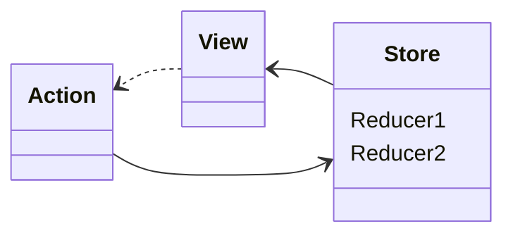
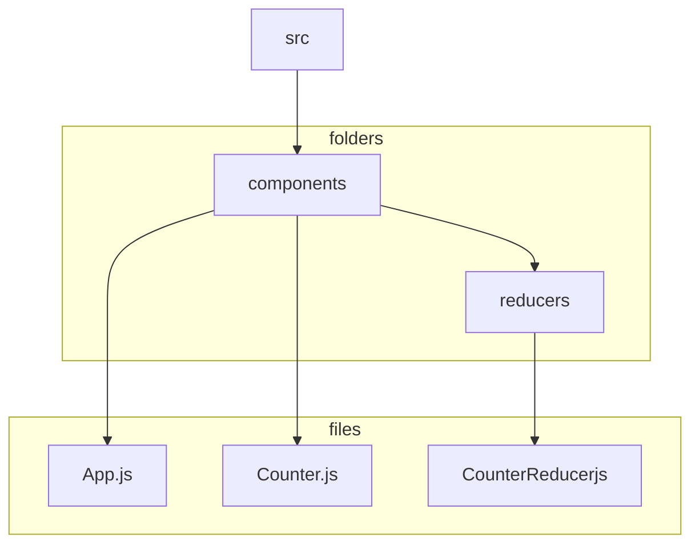
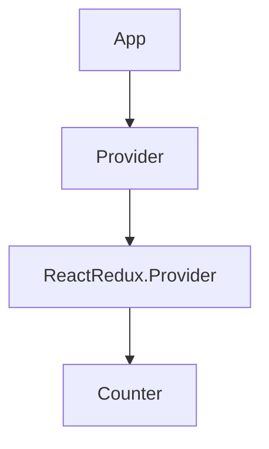

[](https://generalassemb.ly)

# Intro to Redux

## Learning Objectives

- Introduce Redux and why it's used to manage state
- Understand Redux Terminology such as `Store`, `Actions`, and `Reducers`
- Add Redux to a project and use it as a `global store` for state management
- Refactor a Counter Component to use Redux

## Preparation

In preparation to learn Redux it's assumed that you have previous working knowledge of the following:

- Managing state with both `useState` or `useReducer`
- Understanding how data is passed between components in React, possibly even have worked with `useContent`
- Working knowledge of `switch` statements

## Quick Review

Before we jump into Redux let's take a minute to answer a few questions regarding our current knowledge of React so we can build off that as we learn about `Redux`.

:question: What are some of the differences between `useState` and `useReducer`?

<details><summary>Answer</summary>

### useState

- uses a standard `state` / `setState` approach to managing data
- business logic is handled by separate `handler` functions and each is used to update state

### useReducer

- uses a `state` / `dispatch` approach to managing state
- the `dispatch` function is passed an action and/or a payload of data
- encapsulates all business logic needed to update state

</details>

---

:question: When would you opt to use `useReducer` over `useState`?

<details><summary>Answer</summary>

### Reasons to use `useReducer`

- when you need to manage a complex object (e.g. with arrays and additional primitives) instead of primitives (i.e. a string, integer, or boolean)
- when you need to manage more complex state transitions
- when you want more predictable state transitions than useState.

</details>

---

:question: When would you choose to use `useContent` over `useState` and `useReducer` and provide a use case?

<details><summary>Answer</summary>

### Reasons to use `useContext`

- To create a global form of state
- To prevent the need to use `prop drilling` as a means to pass props down several layers of the component hierarchy
- To provide state values to very targeted components

### Use Cases Include

- User profile info, such as avatar, located in several components throughout the app
- To apply specific themes throughout the app

</details>

## Intro To Redux

Redux was created as a `state management` tool for large applications which includes the need to manage complex versions of state and ever increasing complexity of the business logic.

If your learning about Redux then it's safe to assume that you are already familiar with managing state using `useState`, `useReducer` and possibly even `useContext`.  This familiarity is important as it uses both the `reducer` and `context` concepts.

---

### :alarm_clock: Activity - 2min

Let's take a look at the documentation on the official [Redux](https://react-redux.js.org/introduction/quick-start) site.

---

<!-- So instead of this nightmare of passing props down and through multiple components: -->

### The Need For Global State

As we can see below the nightmare of passing props further and further down the hierarchy may at some point become confusing and/or unmanageable. Redux creates a `central store` that any component can reference and pull the data they need when they need it.


<!--  -->

<!-- We can pass them accessed directly via a central `store`

 -->

## Redux Terminology

Redux brings with it some new terminology so let's review these new terms first before we implement it.



<!--  -->

### Store

The store is the single source of truth our app. The store encapsulates not only the data in the program, but also controls the flow of the program using `reducers` and `actions`.

#### Actions

`Actions` are simply JavaScript objects that describes what change is being made and includes any data relative to that change.  The only `requirement` is that the object must contain a key called `type`.

Any additional key/value pairs that are included are completely optional and dependent on the need of the app.

Here is an action object that intends to increment the counter by `1`.

```js
{ type: "INCREMENT" } 
```

Although this meets the min requirements of an `action` we can extend it to include additional values.  So perhaps we want to control by how much the value is incremented.  For that we can add a new key called `value`.

```js
{ type: "INCREMENT", value: 1 } 
```

We can continue that logic and create an action to decrement the counter by 1.

```js
{ type: "DECREMENT", value: 1 }
```

#### Reducers

When an action gets dispatched it is sent to a `Reducer` to perform the actions needed as they were set in `type`.   The `Reducer` is a pure function that describes how the action will update the store (aka state object)

The Reducer always take the previous state and the action that was dispatched and then returns a brand new state.

The body of the function is always a `switch` statement that evaluates the `type` property in the action and executes the needed business logic.

```js
/** @type {({ count : number }, action: { type: "INCREMENT" | "DECREMENT" }) => {count: number}} */
const counterReducer = (state, action) => {
  switch (action.type) {
    case "INCREMENT":
      return {
        count: (state.count += 1),
      };
    case "DECREMENT":
      return {
        count: (state.count -= 1),
      };
  }
};

```

## Working With Redux

Now that we have a basic understanding of how `actions` and `reducers` are used let's jump into setting up `Redux`.

For this demo we will be using the following starter code: [CodeSandbox - Redux Counter - Starter](https://codesandbox.io/s/counter-redux-counter-starter-b27kd)

<https://codesandbox.io/s/counter-redux-counter-starter-b27kd>

<!-- [CodeSandbox - Redux Counter - Starter](https://codesandbox.io/s/counter-redux-counter-starter-b27kd) -->

Here are the steps we will follow to configure and use Redux:

- Install redux packages (`react-redux & redux`)
- Create a `reducer`
- Add Redux to our App by importing `createStore` from `redux`
- Create a `store` and pass it a reducer
- Provide the state using a `Provider`
- Dispatch `Actions` from the child components
- Subscribe a component to the global store using `connect`

Once that is all done our app will look like this:
[CodeSandbox - Redux Counter - Solution](https://codesandbox.io/s/counter-redux-counter-solution-2zo38?file=/src/components/Counter.js)

<https://codesandbox.io/s/counter-redux-counter-solution-2zo38?file=/src/components/Counter.js>

### Install Redux Packages

For the ease of the lecture the following libraries have already been installed in the CodeSandbox starter code.

- react-redux
- redux

### Create A Reducer

Reducers receive an `action` and update state based on the action value . Large applications often have more than one reducer so it's a good idea to create a folder and place all your reducers there.

Let's create a `reducers` folder and then create a file called `counterReducer.js`



<!--  -->

Let's create a bare bones `counterReducer` function that simply returns state as an object with a key of count.

```js
const counterReducer = (state = 0, action) => {
  return {
    count: state,
  };
};

export default counterReducer;
```

Now let's add the logic needed to update state based on one of the following actions that align with the existing handler functions.

- INCREMENT
- DECREMENT
- RESET

A `switch` statement is used to implement the conditional logic.

```js
const counterReducer = (state = 0, action) => {
  switch (action.type) {
    case "INCREMENT":
      return {
        count: (state.count += 1),
      };
    case "DECREMENT":
      return {
        count: (state.count -= action.value),
      };
    case "RESET":
      return {
        count: (state.count = action.value),
      };
    default:
      return {
        count: state,
      };
  }
};

export default counterReducer;
```

## Adding Redux To The App

Adding `Redux` to the app means creating a new `store`. Since the App is the top level Component we will be adding our global `store` there.

### The Store

A `store` is used to hold one global state object.  There is only one single store for the entire application.  The `store` is responsible for managing state which includes performing state updates based on the `actions` it receives.

Creating a store requires that we first import `createStore` from `redux`.

```js
import { createStore } from "redux";
```

The `store` will also need to be passed a reducer so let's import the `counterReducer` function as well.

```js
import counterReducer from './reducers/counterReducer'
```

#### Create A Store

Now let's create our global store and pass it the counterReducer we created earlier.

```js
const store = createStore(counterReducer);
```

Once that's done, we can check the current state that has been initialized via our reducer by using the `.getState()` method.

```js
console.log("Current State:", store.getState());

// => Current State: {count: 0}
```

You will often see the words `state` and `store` used interchangeably. Technically, the state is the data, and the store is where it’s kept.

### Provide State To The Application

Now in order to provide access to the `store` throughout our entire React app will need to do so via the `Provider`.  

Lets import the `Provider` from `react-redux`.

```js
import { Provider } from "react-redux"
```

Now we will wrap our component in the redux `Provider` and pass in the store.  

```jsx
<Provider store={store}>
  <div>
    <Counter />
  </div>
</Provider>
```

Let's take a look at React Dev Tools and we should see the provider.



<!--  -->

---

:question: Can you think of other instance where you wrapped a component like so and saw a reference to `Provider` in React Dev Tools?

---

<details>
<summary>Answer</summary>

### React Router

```jsx
ReactDOM.render(
  <Router>
    <App />
  </Router>,
  document.getElementById("root")
);

```


### useContenxt Hook

```jsx
<DataContext.Provider value={userData}>
  <ComponentA />
  <ComponentE />
</DataContext.Provider>
```


</details>

### Dispatch Action

To update state we need to `dispatch` an action to our store.  For this the `store` object provides a `dispatch()` method.

Let's test calling `dispatch` and increment count by 1.

```js
const store = createStore(counterReducer);
store.dispatch({ type: "INCREMENT", value: 1 });
console.log("Current State:", store.getState());
```

You should see the following in the console:

```js
Current State: {count: 0}
Current State: {count: 1}
```

### Connect The Component To Redux

We now need to  connect the Component to the store.  For that we will import the `connect` method into the `Counter` Component as it will consume the provided store data.

```js
import { connect } from "react-redux";
```

The `connect()` method is a higher order function which is a fancy way of saying it returns a function when you call it.  The function it returns will be passed the `Counter` component.

Essentially this returns an entirely new Component altogether.

```js
export default connect()(Counter);
```

If we take a look at React Dev Tools now we will be able to see that it is being passed down a dispatch function.


It is however not yet being passed the count value in our global state so let's wire that up now.

### mapStateToProps

In order to access the state in the the store we need to pass `connect()` a function that will provide access to the values we need. It essentially maps the values in state and passes them as props to the Component.  

One thing to note is that the function needs to be created outside of the Counter Component so that it's within the scope of `connect`

```jsx
const Counter = (props) => {
  // Counter component code
}

const mapStateToProps = (state) => {
  return {
    count: state.count,
  };
};
```

Now pass connect the function.

```jsx
export default connect(mapStateToProps)(Counter);
```

If we take a look at React Dev Tools now we will be able to see that props contains count.


### Update onClick Methods

Since `dispatch()` is being passed down via props we will use that method to pass the type of action to be performed along with the value.

```jsx
const handleIncrement = () => {
  props.dispatch({ type: "INCREMENT", value: 1 });
};

const handleDecrement = () => {
  props.dispatch({ type: "DECREMENT", value: 1 });
};

const handleReset = () => {
  props.dispatch({ type: "RESET", value: 0 });
};
```

### mapDispatchToProps

We can take this even one step further and replace those supporting `handler` methods and map them directly to dispatch.

Add a new function called `mapDispatchToProps` outside of the Counter Component.

```jsx
const mapDispatchToProps = (dispatch) => {
  return {
    handleIncrement: () => dispatch({ type: "INCREMENT", value: 1 }),
    handleDecrement: () => dispatch({ type: "DECREMENT", value: 1 }),
    handleReset: () => dispatch({ type: "RESET", value: 0 }),
  };
};
```

Since `connect` is what does the binding we need to pass the function to it as well.

```jsx
export default connect(mapStateToProps, mapDispatchToProps)(Counter);
```

And lastly update the buttons to reference these new props.

```jsx
<button onClick={props.handleIncrement}>+</button>
<button onClick={props.handleDecrement}>-</button>
<button onClick={props.handleReset}>Reset</button>
```

### Redux Developer Tools

Redux has a great [Redux DevTools](https://chrome.google.com/webstore/detail/redux-devtools/lmhkpmbekcpmknklioeibfkpmmfibljd?hl=en) chrome extension.

First we must download and install it and then update `createstore` with the following in order to use it.

```jsx
const store = createStore(
  reducer,
  window.__REDUX_DEVTOOLS_EXTENSION__ && window.__REDUX_DEVTOOLS_EXTENSION__()
);
```

Now open dev tools and you should see a new `Redux` tab.  If you click on that you will see the following.


In the Redux App click the `Action` tab and work with the app for a bit.  As you click any of the buttons you will see actions being added and the info about what the action contained.


### Resources

- [React-Redux Tutorial - Robin Wieruch](https://www.robinwieruch.de/react-redux-tutorial#redux-store)
- [What Does Redux Do? - david ceddia](https://daveceddia.com/what-does-redux-do/)
- [How Does Redux Work? - david ceddia](https://daveceddia.com/how-does-redux-work/)
- [React Redux Connect Tutorial - logrocket](https://blog.logrocket.com/react-redux-connect-when-and-how-to-use-it-f2a1edab2013/)
- [useReduer vs Redux - Robin Wieruch](https://www.robinwieruch.de/redux-vs-usereducer)
- [Official Redux Docs](https://redux.js.org/tutorials/essentials/part-1-overview-concepts)

---

_Copyright 2022, General Assembly Space. Licensed under [CC-BY-NC-SA, 4.0](https://creativecommons.org/licenses/by-nc-sa/4.0/)_
