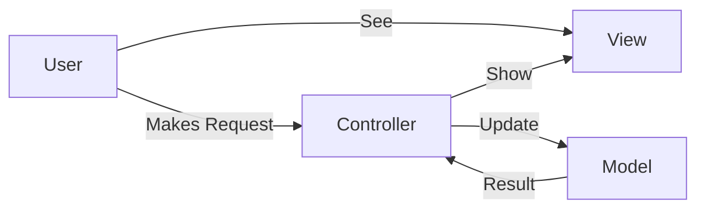
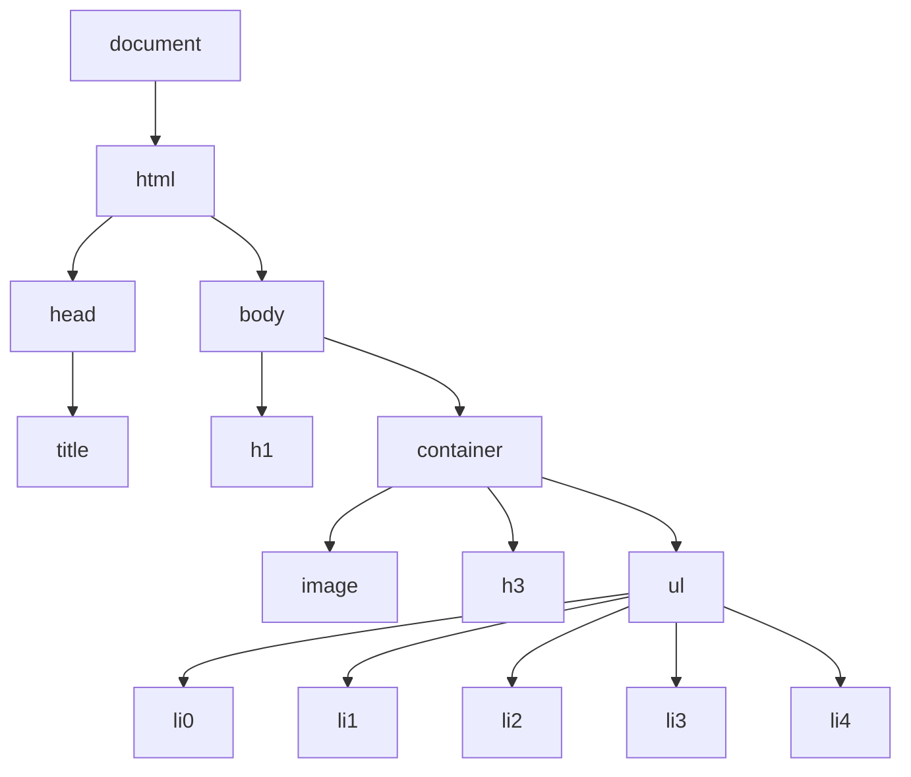

[](https://generalassemb.ly)

# Intro to React.js


## Learning Objectives

- Explain what a frontend framework is and why they can be helpful in writing more complex applications.
- Explain what React.js is and where it fits in our applications' stack.
- Explain the component model of web development.
- Create and render React components in the browser.

## Framing

### The Rise and Fall of jQuery

I'm sure everyone has either heard or worked with jQuery in their Front End Dev career. It was first introduced in 2006 and now close to [20 million web sites](https://www.similartech.com/compare/jquery-vs-react-js) have been built using the library vs the 1 million+ for React.


jQuery was the tool of choice for front end developers for a quite sometime, but it's starting to run its course and is being replaced by libraries that also fall into the category of `framework`.

### The Birth of the Frontend Frameworks

As the world of front end development and software engineering grows in complexity so does the need to create new tools that facilitate the development process, increase the efficiency of writing code and the performance our our application.

Several years after the birth of jQuery several front end frameworks were introduced that provided a much more structured and opinionated way of writing code. Here are a few of the most well known frameworks:

| Framework | Year Introduced |
| :-------: | :-------------: |
|  Angular  |      2009       |
| Backbone  |      2010       |
|   Ember   |      2011       |
|   React   |      2013       |

---

#### :alarm_clock: Activity - 7min

The following questions are based on the article you were asked to read for homework: [javascript-frameworks-vs-libraries](https://skillcrush.com/blog/javascript-frameworks-vs-libraries/)

Students will be placed in breakout rooms to discuss and come us with a single group generated answer.

Think about what a front end framework is and answer the following questions:

- How is React different than a JavaScript library like jQuery?
- What benefit comes from using a framework like React?
- When would you consider using a library and framework together?
- Write our your answer in a slack thread to yourself

When asked slack your answer in the thread created by the instructor

---

### Front End Frameworks

A framework is a library that provides generic functionality and structure that serves as a foundation to build and deploy applications.

The following are just a few of the most popular front end frameworks mentioned in [https://stateofjs.com/](https://stateofjs.com/)

- React
- Vue
- Angular
- Ember

Frameworks can help standardize code, give you additional functionality and performance, and can help get your code off the ground faster.

### Sites Built On React

First, let's review a few of the most popular web sites built in React:

- Facebook - They actually built React!
- Instagram - It's public feed and internal system are entirely built on React.

As you can imagine they are not the only popular sites built in React.

---

#### :alarm_clock: Activity - 2min

Let's take a look at this article [32 Web Sites Built In React](https://medium.com/@coderacademy/32-sites-built-with-reactjs-172e3a4bed81)

- Look over the sites and determine which ones you have used in the past or perhaps use on a daily/weekly basis
- When asked slack your answer in the thread created by the instructor

---

### The History of React

The first thing most people hear about React is `Facebook uses it`. As mentioned before Facebook actually created React to meet the demands of the most popular social media platform of it's day.

- First used by Facebook in 2011.
- Adopted by Instagram in 2012.
- Made open source in May 2013.
- Not long after React was embraced by the dev community.

React was born out of Facebook's frustration with the traditional MVC model and:

- how re-rendering something meant re-rendering **everything** (or just a lot).
- how it had negative implications on processing power and ultimately user experience, which at times became glitchy and lagging.

### What Is React.js

React is a JavaScript `framework` used to craft modern day UI for the front-end in web applications. It essentially takes the UI and breaks it down into reusable `Components`.

By modeling small reusable `Components` that focus on just rendering a specific portion of the view, React can improve an app's performance, maintainability, modularity and readability.

#### React Alone Can't Build A App

React can co-exist with other Javascript libraries and frameworks. If fact there are many helper libraries that developers use quite often like, `Lodash`, `Underscore` or `Ramda` which are great for performing adv JS functionality.

React is also `front end` only and would require working with other frameworks to handle
the `models - (data)` and `controllers - (business logic)` while having React single handedly manage the views.

---

#### :alarm_clock: Activity - 5min

Of the 32 sites that we examined before a few of them were clearly only built from the ground up in the last few years, such as [Postmates](https://postmates.com/).

From looking at the sites UI we can't really see React. It's there working under the hook but just not so apparent on the surface. So let's peel back a layer and see React in action.

This involves installing [React Chrome Developer Tools](https://chrome.google.com/webstore/detail/react-developer-tools/fmkadmapgofadopljbjfkapdkoienihi?hl=en)

:thumbsup: Take a moment to install the tool and then open `DevTools` and confirm the following tabs have been added:


The instructor will provide a quick walk through of the tool.

---

### Becoming A React Developer

Learning React requires that one have an understanding and working knowledge of basic front end technologies, such as:

- HTML
- CSS
- JavaScript (ES6, ES7, ES8)

It then opens the door to a whole new world of development tools that are used in the React ecosystem. The [React Developer Roadmap](https://hackernoon.com/the-2020-reactjs-developer-roadmap-8q143yan) does a good job of documenting the technologies and concepts that one will be exposed to when working in React.


### React in MVC

The MVC architecture is a JavaScript design pattern for building an applications. It isn't the only design pattern being used and others exist such as `MV*`, `MVP`, `MVVM` but the `MVC architecture` is used quite often and represents the following:

- `M stands for Model`
- `V stands for Views`
- `C stands for Controller.`

The `View` is the presentation layer, it’s what the user sees and interacts with in the browser. The `Controller` makes the decisions based on requests and then controls what happens in response, like clicking on links and submitting forms and communicates with the `Model`, which is the database.

`React` is the `View` in this model.



<!--  -->

The backed represented here by `Controller` and `Model` can be implemented using any backend framework such as:

- Node/Express
- Ruby on Rails
- Python/Django
- PHP

## The Virtual DOM For Efficiency

The `Document Object Model` or _DOM_ for short is an API that is used to interact with the HTML that is displayed on a page. The following structure represents the _DOM_ and starts with the `document` object.



<!--  -->

If you have ever used `document.getElementById('someid)` or `$('#someid)` then you have worked with _DOM_.

The Virtual DOM is a representation of the actual _DOM_ and is a staging area for changes that will eventually be implemented. Because of that, React can keep track of changes in the actual _DOM_ by comparing different instances of the Virtual DOM.


React then isolates the changes between old and new instances of the Virtual
DOM and then only updates the actual DOM with the necessary changes as opposed to re-rendering an entire
view altogether which is significantly more efficient.


### Getting Started With React

So now it's time to get started with React. For this demo we will be using a new folder called `first-react`, with the following `index.js`:

```js title="index.js"
console.log("Hello React");
```

and the following `index.html`

```html title="index.html"
<!DOCTYPE html>
<html lang="en">
  <head>
    <meta charset="UTF-8" />
    <meta http-equiv="X-UA-Compatible" content="IE=edge" />
    <meta name="viewport" content="width=device-width, initial-scale=1.0" />
    <title>First React</title>
    <script defer src="index.js"></script>
  </head>
  <body>
    <h1>First React</h1>
    <div id="root"></div>
  </body>
</html>
```

#### Configuring Our React App

For this demo we will focus on:

- Installing the required dependencies (libraries): `(react & reactDOM)`
- Importing the libraries into `index.js`
- Using `ReactDOM.render()` to render our initial content.

#### Adding Dependencies

Let's add the dependencies first. Add the following code to the `index.html`

```html title="index.html" {2-3}
<head>
  <script src="https://unpkg.com/react@17/umd/react.development.js"></script>
  <script src="https://unpkg.com/react-dom@17/umd/react-dom.development.js"></script>
  <!-- Make sure your index.js is below the 2 react scripts -->
  <script defer src="index.js"></script>
</head>
```

Take note of the react version which in this case is `React 17`.

As of `16.8` React introduced `Hooks` which has changed that way we write React Components and we will use `Hooks` for the entire curriculum.

<!--  -->

---

The one element inside the `index.html` file that we need to be aware of right now is:

```html title="index.html"
<div id="root"></div>
```

This will be the element that React mounts to and will use to render the entire app.

<!--
#### Importing The Libraries

Before you can work with React, or any library for that matter, we must import them into the file in which they will be used.  In our case let's import the libraries into `index.js`.

```jsx
// IMPORT React
import * as React from "react";
// IMPORT ReactDOM
import ReactDOM from "react-dom";
``` -->

#### ReactDOM.render()

With our libraries in place we can use `ReactDOM.render()` to render either, a `Component` or `HTML` to the screen, in our basic starter app we will render some basic `HTML` for now.

`ReactDOM.render()` accepts the following two arguments:

- The HTML or Component name to render
- The DOM element we want to mount react to which in our case is: `<div id="root"></div>`

```js title="index.js"
// GRAB THE ELEMENT WITH AN ID OF ROOT AND STORE IN A VARIABLE CALLED rootElement
const rootElement = document.getElementById("root");

const element = React.createElement("h1", { children: "Hello World" });
console.log(element);

// USE ReactDOM TO RENDER SOME HTML
ReactDOM.render(element, document.getElementById("root"));
```

We should see our app update to display the following:

> Hello World

We only have to use `ReactDOM.render()` once when `mounting` React to our html. For every React app we build going forward this step will already have been completed for us and so we will never need to do this manually again.

---

#### Using JSX

Using `React.createElement()` is very verbose, so most of the time we tend to use JSX. JSX stands for JavaScript XML, which is a syntax extension to Javascript.

You can [read more about JSX](https://reactjs.org/docs/introducing-jsx.html) as well as read about [some differences](https://reactjs.org/docs/dom-elements.html)

Change your `index.js` to comment out the previous `element` and use the following code and then refresh your browser.

```jsx title="index.js" {2}
// const element = React.createElement("h1", { children: "Hello World" });
const element = <h1>Hello World</h1>;
console.log(element);
```

We will see an error in the console as the above is not valid Javascript. We need Babel to change the syntax into valid Javascript.

[Babel](https://babeljs.io/) is a compiler for Javascript, it takes in next generation Javascript syntax and compiles (transforms) them into valid Javascript that your browser can understand.

We add Babel by making the following changes to your `index.html`

```html title="index.html" {4-5}
<head>
  <script src="https://unpkg.com/react@17/umd/react.development.js"></script>
  <script src="https://unpkg.com/react-dom@17/umd/react-dom.development.js"></script>
  <script src="https://unpkg.com/@babel/standalone@7.8.3/babel.js"></script>
  <script defer type="text/babel" src="index.js"></script>
</head>
```

#### :alarm_clock: Activity - 3min

Let's take a moment to examine `index.html`

- Look for the element with an `id=root`
- Does it have any HTML directly inside of it?
- Investigate the same element in `Chrome Developer Tools` and we should see the following:


Now, in the JS, cut the entire element with `className=App` and paste it over the `<h1>` in `index.js`.

```jsx title="index.js" {2-5}
ReactDom.render(
  <div className="App">
    <h1>Hello CodeSandbox</h1>
    <h2>Start editing to see some magic happen!</h2>
  </div>,
  document.getElementById("root")
);
```

React will re-render and our page should display the content.

Take special note that React also renamed `className` to `class`. This is something we will address once again in future lectures.


---

### Resources

- For an intro to React, watch [this video](https://generalassembly.wistia.com/medias/lr8idjxtx8).
- [Essential JS Design Patterns](https://addyosmani.com/resources/essentialjsdesignpatterns/book/)

---

_Copyright 2022, General Assembly Space. Licensed under [CC-BY-NC-SA, 4.0](https://creativecommons.org/licenses/by-nc-sa/4.0/)_
