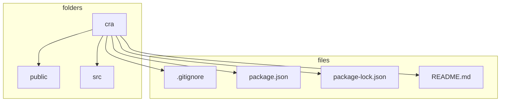
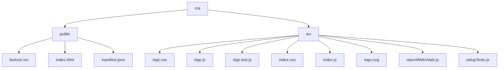
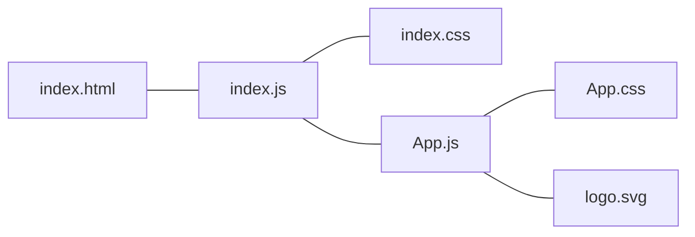
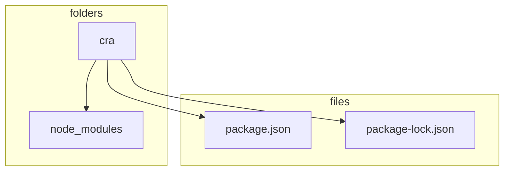

[](https://generalassemb.ly)

# Intro to Create React App

## Learning Objectives

- Learn about Create React App
- Learn what some of the pros and cons of Create React App are
- Learn how to build an app with Create React App

## It's the Future Y'all

If you've googled anything about what to learn to be a web developer, you've likely been overwhelmingly crushed by the number of tools, technologies and buckets full of acronym soup.

All of these tools are meant to solve problems. But with too many tools it can be a problem in and of itself. Which one(s) do you learn? Additionally, as new web developers a lot of the tools can seem like total magic and it can be really hard to to figure out what is what and it can even impede learning when you take on too much too fast. Especially when the documentation is not very good.

So we've been really selective about which tools we teach. Thinking about what be will serve you post-course.

**Create React App** is built buy facebook and it is meant for:

- Learning React in a comfortable and feature-rich development environment (good errors! warnings, notes about best practices, hot reloading, zero configuration)
- Starting new single page applications
- Creating Examples with react for your libraries and components

[More info](https://github.com/facebook/create-react-app#creating-an-app)

Create React App (CRA) isn't the best choice for:

- a sandbox where you just want to try some samples out (try a simple html page like we did yesterday or a react sandbox - linked above)
- A mostly static site (portfolio, blog) - try Gatsby!
- Server side rendering (yes! With a front-end framework! What is next? Cats and dogs being friends?!) - look into Next.js

Takeaway - soon you'll be on your own and you'll be trying to learn new things and get ready for job interviews. How do you figure out what to learn?

- figure out what you want to build and THEN figure out the right tools
- Start small and then add what you need
- Look at the job market and learn something that seems to be popular in the area

## Let's get started

- `npx create-react-app cra`
- `cd cra`
- `rm -rf .git` - because we are in the class repository - no git reps inside other git repos!
- open a new tab in terminal
- `npm start`
- in the other open tab `code .`



Let's look at our folders



<!--  -->

The `public` folder holds static assets like the favicon and the `index.html` that will load in the browser

The `src` folder has a lot new things

- `App.css` - a different way to organize and use CSS than what we are used to. [As a bonus you can learn this way](https://facebook.github.io/create-react-app/docs/adding-a-stylesheet) or we can just link our CSS like we always have been or you can work in the `index.css` file

- `App.js` the main React component, we'll be writing in here
- `App.test.js` - we haven't gotten a chance to dive into testing but if you look at the code, in summary it says if the app doesn't crash load it. If the app does crash a lot of things happen but they require some deeper poking around
- `index.css` - if you do your css in here, it will be most familiar to what we've already been doing in the course.
- `index.js` - this file has some magic going in in it. Suffice to say, if you create React components in the `src` folder, they will magically work
- `logo.svg`-that's that spinning react logo you see in the browser. SVG is a really great technology worth exploring sometime later...

Another look of the files with their relations:



Note: if you need to add a dependency you'd just run `npm install react-router-dom` or any other dependency you might want.

## Let's Get Coding

- Open the `src` folder
- open the `App.js` file
- remove the text inside the `p` tag and put some of your own words

```jsx title="App.js"
<p>Pleased to meet you</p>
```

- save the file
- look at the browser


Notice! you didn't have to reload the browser! 🎉

## Make This App Our Own

Let's remove all the create react app showcase stuff and rewrite our component to be a function. There are a few ways to make react components. We're going to stick with functions. Later, when you feel more confident you can explore different ways to write them

```jsx live title="App.js"
function App() {
  return <h1>Hello World</h1>;
}
```

## Alternatives to CRA

As CRA bundles a lot of `npm` modules it takes a lot of space. A slimmer alternative is using [Vite](https://vitejs.dev/)

```bash
# npm 6.x
npm init vite@latest my-react-app --template react

# npm 7+, extra double-dash is needed:
npm init vite@latest my-react-app -- --template react
```

Just some notes about using Vite:

- You need `import * as React from "react"` as Vite is not using the latest Babel compiler
- Your files need to end with `.jsx` extension if you're using JSX inside

## Install Node packages

- Node.js is an application that lets us run JavaScript outside of the browser and in the terminal. We'll use node.js to build a Single Page Application using React.

- Built into Node.js is something called `npm`, which stands for `Node Package Manager`, which will manage Node Packages

- Node packages are libraries (or frameworks - see below) of code that provide useful functionality. Much like jQuery for the browser, node packages help us write sophisticated programs with a lot of useful functionality right out of the box. These packages are published at [www.npmjs.com](https://www.npmjs.com/)

These chunks of code fall into one of two categories

- Libraries
  - A collection of functions, objects, and even other libraries that you call
  - It has no idea what you're going to build
- Frameworks
  - Is essentially just a library
  - Is also a pre-conceived skeleton for an application
  - It knows what you're going to build and is somewhat opinionated about how you should do it

## Activity - Download our First npm Package

Here is a very minimal `package.json` - it's just a text file with an object in it

```json title="package.json"
{
  "name": "cra",
  "version": "0.1.0",
  "private": true,
  "dependencies": {
    "@testing-library/jest-dom": "^5.14.1",
    "@testing-library/react": "^11.2.7",
    "@testing-library/user-event": "^12.8.3",
    "react": "^17.0.2",
    "react-dom": "^17.0.2",
    "react-scripts": "4.0.3",
    "web-vitals": "^1.1.2"
  },
  "scripts": {
    "start": "react-scripts start",
    "build": "react-scripts build",
    "test": "react-scripts test",
    "eject": "react-scripts eject"
  },
  "eslintConfig": {
    "extends": ["react-app", "react-app/jest"]
  },
  "browserslist": {
    "production": [">0.2%", "not dead", "not op_mini all"],
    "development": [
      "last 1 chrome version",
      "last 1 firefox version",
      "last 1 safari version"
    ]
  }
}
```

It's totally ok to edit this file - for example, if I forgot to put myself as the author I could add it as a string. If I didn't like my project name, I could update it too. **GOTCHA** be careful to keep this as a proper object and keep track of your strings or else you will get errors and your code will not run.

To install (download) a package, first you must know its name (each name is unique in `npm`). Then run:

```bash
npm i <package-name>
```

**Note**: `npm i` - is new as of version 5.0.0, older versions of `npm` require you to type `npm install` instead. You can type `npm install` with version 5.0.0 (and up) with no errors.

Additionally, in the old version it was required to type `--save` in order to update the `package.json`, with version 5.0.0 `npm i` automatically updates the `package.json`. If you type `npm i express --save` with the new version, it won't error or do anything different. If you are running 4.x.x or below, if you forget to type `--save` it won't update the `package.json`

As you explore different `npm` packages and read documentation you may see one syntax or the other.

Let's install the library `eslint`:

```bash
npm i eslint
```

We can see that we've successfully added because or `package.json` file will have updated (under dependencies)

```json title="package.json" {5}
"dependencies": {
  "@testing-library/jest-dom": "^5.14.1",
  "@testing-library/react": "^11.2.7",
  "@testing-library/user-event": "^12.8.3",
  "eslint": "^7.32.0",
  "react": "^17.0.2",
  "react-dom": "^17.0.2",
  "react-scripts": "4.0.3",
  "web-vitals": "^1.1.2"
},
```

Additionally, we see that we now have a directory called `node_modules` and a file called `package-lock.json`



We're not going to edit our `package-lock.json` file, it's just a helper file for `npm` that helps `npm` do some under the hood stuff.

Inside `node_modules` is all the code that was downloaded so we could use `react`, the code is tucked into folders that are managed by npm. Like jQuery, we don't ever have to look at the source code or modify it in any way, it can just sit there and we'll bring in the code and use it in our own files.

## package.json and node_modules revisited

When we installed CRA it installed a lot of code (inside `node_modules`) - we don't need to track these files and upload/download them to and from github. All the info needed is in the `package.json`

To avoid tracking/uploading/downloading files that don't need to be tracked or shouldn't be tracked (passwords, secrets) you can create a file called `.gitignore`

It will ignore whatever files and folders you tell it. Our class repository already has a `.gitignore`, but when you start your own projects, you'll want to be sure to create one.

Let's give it a whirl:

1. Create a file called `.gitignore`
2. In it, add the line `node_modules`
3. You can check to see if it works by going to `github` if you see your `node_modules` folders there, you have not properly ignored your `node_modules`
4. note, our class repo already has a `.gitignore`, so you really should never see `node_modules` there
5. At first, it won't matter if you ignore your node modules. But once you go to host your server on the web, having these tracked can cause weird errors and make your server break. We'll talk about this more later.

---

_Copyright 2022, General Assembly Space. Licensed under [CC-BY-NC-SA, 4.0](https://creativecommons.org/licenses/by-nc-sa/4.0/)_
