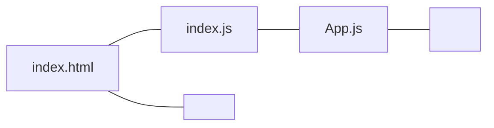
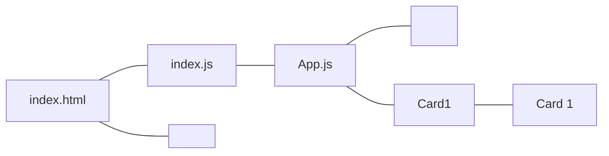
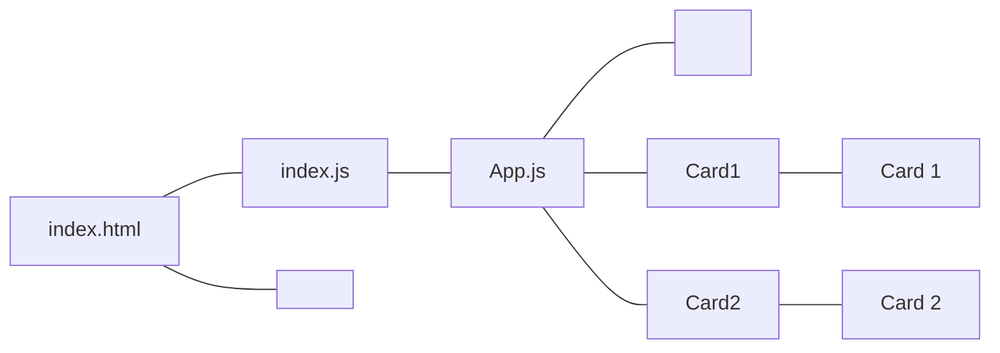
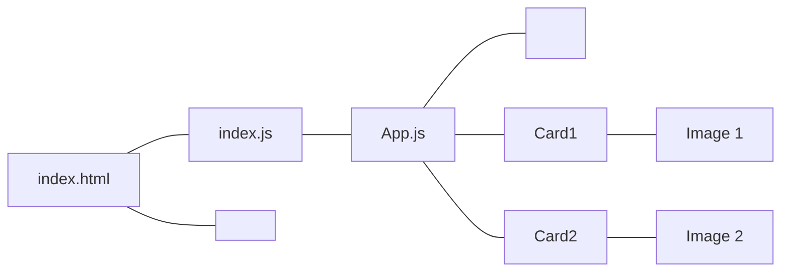
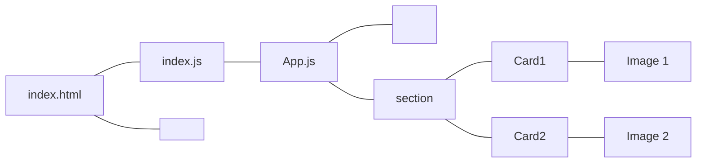
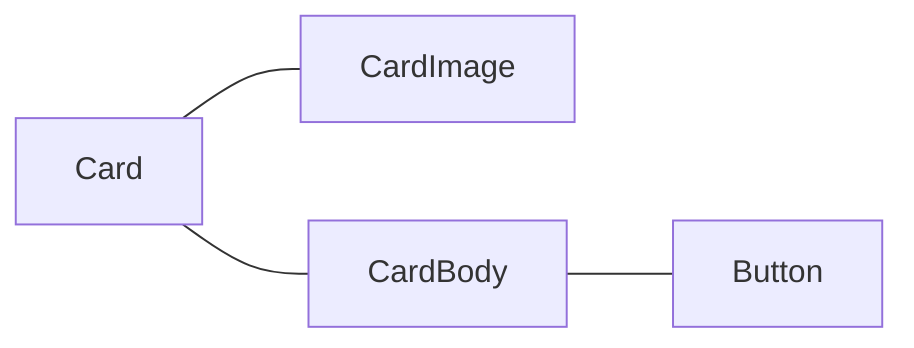
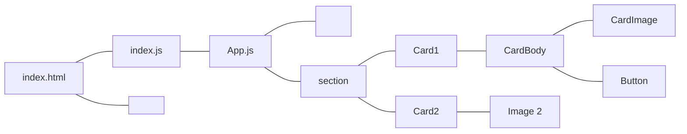

[](https://generalassemb.ly)

# Nested Components

## Learning Objectives

- Create and nest multiple Components

## Components

As we've explained Components are the fundamental building blocks of React and let you split the UI into independent, reusable pieces, and be able to use each one in isolation.

This is very similar to the way we write JavaScript functions in general. They are meant to be `independent` and `reusable`. By passing in `standardized` input they will return `standardized output`.

Components behave under the same premise and, if configured to accept input, will return UI that is either includes the input or has influenced how the input is displayed.

The input we will pass to a Component is called a `prop` and we will use them extensively in any React app we build.

### Nested Components Details

Let's revisit the Bootstrap card example. It provides all the HTML needed to produce a standard `card` and, along with Bootstrap css, styles the card quite nicely.

Here is the HTML provided by Bootstrap:

```html
<div class="card" style="width: 18rem">
  
  <div class="card-body">
    <h5 class="card-title">Card title</h5>
    <p class="card-text">
      Some quick example text to build on the card title and make up the bulk of
      the card's content.
    </p>
    <a href="#" class="btn btn-primary">Go somewhere</a>
  </div>
</div>
```

In order to bridge the gap of what defines a Component we will be creating a custom React Card Component that uses the Bootstrap HTML.

---

#### :alarm_clock: Activity - 3min

Create a new CRA app. Replace the `index.html` with the following:

```html title="index.html"
<!DOCTYPE html>
<html lang="en">
  <head>
    <meta charset="utf-8" />
    <meta
      name="viewport"
      content="width=device-width, initial-scale=1, shrink-to-fit=no"
    />
    <meta name="theme-color" content="#000000" />
    <link
      rel="stylesheet"
      href="https://stackpath.bootstrapcdn.com/bootstrap/4.5.2/css/bootstrap.min.css"
      integrity="sha384-JcKb8q3iqJ61gNV9KGb8thSsNjpSL0n8PARn9HuZOnIxN0hoP+VmmDGMN5t9UJ0Z"
      crossorigin="anonymous"
    />
    <title>React App</title>
  </head>

  <body>
    <noscript> You need to enable JavaScript to run this app. </noscript>
    <div id="root"></div>
    <section class="cards">
      <div class="card" style="width: 18rem;">
        
        <div class="card-body">
          <h5 class="card-title">Card Title</h5>
          <p class="card-text">
            Some quick example text to build on the card title and make up the
            bulk of the card's content.
          </p>
          <a href="#" class="btn btn-primary">Go somewhere</a>
        </div>
      </div>
      <div class="card" style="width: 18rem;">
        
        <div class="card-body">
          <h5 class="card-title">Card Title</h5>
          <p class="card-text">
            Some quick example text to build on the card title and make up the
            bulk of the card's content.
          </p>
          <a href="#" class="btn btn-primary">Go somewhere</a>
        </div>
      </div>
    </section>
  </body>
</html>
```

And replace your `index.css` to the following:

```css
section.cards {
  display: flex;
  align-items: center;
}

section.cards .card {
  margin: 0 10px;
}

.card-img,
.card-img-bottom,
.card-img-top {
  height: 300px;
  object-fit: cover;
}
```

And replace your `App.js` to the following:

```jsx title="App.js"
export default function App() {
  return (
    <div className="App">
      <h1>Bootstrap Cards To Component Example</h1>
    </div>
  );
}
```

You should see the following:


- Take a moment to examine the code.
- See if you can determine where the `H1` is being rendered as well as the two :two: cards
- The instructor will ask you to post your answer in a thread

:thumbsup: Click on the thumbs up when your done.

---

Our investigation should have determined the following:

- `App` Component - renders the H1
- `public/index.html` - renders the cards



:::note
**Note:** You might have noticed that the App Component was written slightly different then before. It's being both created and exported at the same time and requires less code.
:::

```js title="App.js"
export default function App() {
  //...rest of code
}
```

For the time being we are going to write the Component and export it separately as we want to make it more readable. In time you will come to find that several things can be exported from a file and that will require using the `export` keyword more than once.

#### Creating A Component

So let's take a moment to create a `Functional Components` that contain all the Bootstrap HTML code needed allow us to create the 2 card Components as per our layout.

In the `src` folder create the following files:

- `Card1.jsx`
- `Card2.jsx`

:thumbsup: Click on the thumbs up when your done.

##### Card1

Let's begin with the `Card1` Component.

Inside of `Card1.jsx` let's do the following for now:

- Import React
- Create the Component
- Export the Component

```jsx title="Card1.jsx" live
// IMPORT REACT

// CREATE THE COMPONENT
function Card1() {
  return <div>Card1</div>;
}

// EXPORT THE COMPONENT
```

Remember to add `export default Card1` at the end of the above file;

:thumbsup: Click on the thumbs up when your done.

#### Nesting A Component

As with any layout design, HTML elements must be nested inside other elements to achieve the desired effect.

This is no different for React and since our goal is to render an `H1`, as well as the `cards`, we must call the `Card1` Component within the `return` statement of it's parent Component, in this case `App`.

```jsx title="App.js" {2,8}
// IMPORT CARD1
import Card1 from './Card1'

export default function App() {
  return (
    <div className="App">
      <h1>Bootstrap Cards To Component Example</h1>
      <Card1 />
    </div>
  );
```

If successful you should see the following:




:thumbsup: Click on the thumbs up when your done.

---

#### :alarm_clock: Activity II - 3min

**NOTE:** Before you perform the steps we ask that you do not copy/paste at this time and write everything from scratch. In time copy/paste will be the may be the most efficient way to create Components, however you are just learning how to write Components so the additional manual work will help solidify these concepts.

- Perform the same steps as you did for Card1
- Only change it's _HTML_ output to be `Card2`
- Make sure to render Card2

Your code should produce the following:




:thumbsup: Click on the thumbs up when your done.

---

Now it's time to output the _HTML_ that represents each Component. This, as we we discovered earlier, is found in `public/index.html`

Cut the entire `<div class="card">...</div>` for the first card and place it inside of `Card1`

```jsx title="Card1.jsx" live
function Card1() {
  return (
    <div class="card" style="width: 18rem;">
      
      <div class="card-body">
        <h5 class="card-title">Card 1</h5>
        <p class="card-text">
          Some quick example text to build on the card title and make up the
          bulk of the card's content.
        </p>
        <a href="#" class="btn btn-primary">
          Go somewhere
        </a>
      </div>
    </div>
  );
}
```

:thumbsup: Click on the thumbs up when your done.

We should be immediately met with the following error:


This has to do with a rule related to _JSX_ which is:

:oncoming_police_car: Any JS within JSX must be enclosed in curly braces `{}`

Since style accepts an object with the css key:value pairs (first set of curlys) we then need to surround that in an additional set of curlys.

So the `style` prop must be written in the following format:

```jsx title="Card1.jsx"
style={{key: value}}
```

Let's update our Component to include the proper syntax

```jsx title="Card1.jsx"
<div class="card" style={{width:'18rem'}}>
```

The other _JSX_ rule we must follow is:

:oncoming_police_car: - The keyword `class` is reserved so classes must be renamed `className`

So we need to rename every instance of `class` to `className`.

:thumbsup: Click on the thumbs up when your done.

Here is our Component with those changes:

```jsx title="Card1.jsx" live
function Card1() {
  return (
    <div className="card" style={{ width: "18rem" }}>
      
      <div className="card-body">
        <h5 className="card-title">Card title</h5>
        <p className="card-text">
          Some quick example text to build on the card title and make up the
          bulk of the card's content.
        </p>
        <a href="#" className="btn btn-primary">
          Go somewhere
        </a>
      </div>
    </div>
  );
}
```

---

#### :alarm_clock: Activity - 2min

- Perform the same steps to Card2 as you did for Card1
- Make sure to render Card2
- Refresh the page to see the changes

Your code should produce the following:




:thumbsup: Click on the thumbs up when your done.

---

In the original design the cards were sitting next to each other.

The reason they are no longer doing so is because we did not include the parent `<section class="cards">` element.

Let's add that to the App Component.

```jsx title="App.js"
export default function App() {
  return (
    <div className="App">
      <h1>Bootstrap Cards To Component Example</h1>
      <section className="cards">
        <Card1 />
        <Card2 />
      </section>
    </div>
  );
}
```

If everything worked we should now see our original design in place.




### More Nested Components

When we look at both cards displayed on the page I feel the need to ask myself are there any sections of the card that could be used elsewhere.

Say you if you removed the image and were left with just the `title`, `text` and `button`. Would another layout design benefit from just that grouping of elements?

Or perhaps the image could be a reused as is in another design. And how about the button.

If we took just a moment to actually visualize these Components it might look something like this:


This essentially represents the `React Hierarchy` and show which Components are parents and children.

Another way to view the `React Hierarch` is:



So it seems there is an opportunity to create reusable components.

So let's spin off a few more Components and then import them into both Card1 and Card2 Components.

#### Card Body Component

Let's start with creating a separate CardBody Component. That involves the following:

- Creating a new `CardBody.jsx` file
- Importing React
- Creating the Component
- Copying the HTML for the card body
- Exporting the Component

```jsx title="CardBody.jsx" live
// IMPORT REACT

// CREATE THE COMPONENT
function CardBody() {
  return (
    <div className="card-body">
      <h5 className="card-title">Card title</h5>
      <p className="card-text">
        Some quick example text to build on the card title and make up the bulk
        of the card's content.
      </p>
      <a href="#" className="btn btn-primary">
        Go somewhere
      </a>
    </div>
  );
}

// EXPORT THE COMPONENT
```

#### Render The CardBody Component

We now have a separate Component altogether which we need to import and render into both Card Components.

In Card1.jsx do the following:

- Import the CardBody Component
- Replace the card-body element with `<CardBody />` Component

```jsx title="Card1.jsx"
function Card1() {
  return (
    <div className="card" style={{ width: "18rem" }}>
      
      <CardBody />
    </div>
  );
}
```



---

#### :alarm_clock: Activity - 10min

If we follow the basic pattern we can create and render new Components relatively easily.

Now it's your turn to do the following:

- Create a CardImage Component that returns the just image
- Create a Button Component that returns just the button
- Import CardImage and Button into Card1
- Replace the _HTML_ with those Components

---

_Copyright 2022, General Assembly Space. Licensed under [CC-BY-NC-SA, 4.0](https://creativecommons.org/licenses/by-nc-sa/4.0/)_
